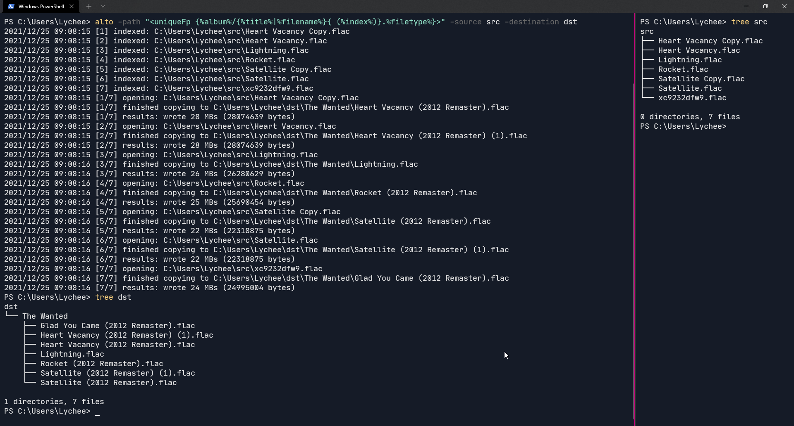

# alto: a music organizer

Alto is a program that provides the means to organize your music with the
provided DSL it has. Simply provide a valid string, and let the program do 
the rest for you. You can find the documentation [here](/docs).

The DSL is contained in an isolated package at `github.com/ItsLychee/alto/dsl`, feel free
to use it in your Go code.

## Installation

Simply run `go install github.com/ItsLychee/alto@latest` for the latest tagged release, or you can
grab a binary in [Releases](/releases), although you will need to put the binary in `PATH` if you want to
use it like any other command.

## Notice

The project alto is licensed under the MIT License, please see [LICENSE](LICENSE) for
more information regarding that.